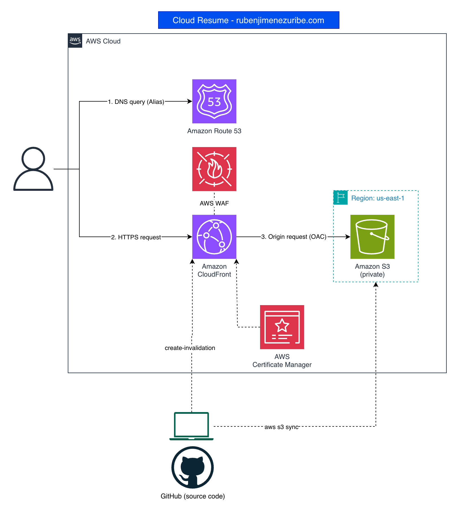

# Cloud Resume on AWS

My online resume, hosted on AWS as a hands-on cloud project.

**Live site:** https://rubenjimenezuribe.com



## Architecture

| Service | Role |
|---|---|
| **Amazon S3** | Stores the static site (HTML/CSS/JS) in a **private** bucket |
| **Amazon CloudFront** | Global CDN, HTTPS termination and caching |
| **Origin Access Control (OAC)** | Only this CloudFront distribution can read from the bucket |
| **AWS Certificate Manager** | Free TLS certificate for the custom domain |
| **Amazon Route 53** | Domain registration and DNS (Alias records to CloudFront) |
| **AWS WAF** | Basic protection included in the CloudFront Free plan |

**Request flow**

1. The visitor's browser resolves `rubenjimenezuribe.com` through Route 53 (A/AAAA Alias records).
2. The browser connects to the nearest CloudFront edge location over HTTPS.
3. On a cache miss, CloudFront fetches the object from S3 using OAC.

## Security decisions

- **Private bucket:** S3 Block Public Access is enabled. The bucket policy only allows `s3:GetObject` to the CloudFront service principal, restricted to this distribution through the `AWS:SourceArn` condition.
- **HTTPS everywhere:** HTTP requests are redirected to HTTPS, using an ACM certificate issued in `us-east-1` (required by CloudFront).
- **No long-lived credentials:** the AWS CLI uses temporary credentials through `aws login`. I removed old access keys and an unused IAM user left over from a previous lab.
- **Account hygiene:** MFA on root and admin users, a dedicated admin user for daily work, and a monthly budget alert.
- **Anti-spoofing:** the domain does not send email, so SPF (`v=spf1 -all`) and DMARC (`p=reject`) records prevent others from impersonating it.

## Repository structure

- `site/`: static website (the only folder deployed to S3)
- `docs/`: architecture diagram (`.drawio` source and PNG export)

## Deploy

```bash
aws s3 sync site/ s3://<bucket-name> --delete
aws cloudfront create-invalidation --distribution-id <distribution-id> --paths "/*"
```

## Cost

Designed to run at close to zero cost:

- CloudFront **Free** flat-rate plan (includes WAF and TLS)
- S3 storage: a few hundred KB
- Route 53 domain registration: about $16 USD per year

## What I learned

- Why a private S3 bucket with OAC is preferred over the public "static website hosting" mode
- Why ACM certificates for CloudFront must live in `us-east-1`
- The difference between Alias and CNAME records, and why the apex domain needs an Alias
- How CloudFront caching works, and when to use invalidations
- Auditing and cleaning up leftover IAM users and access keys

## Roadmap

- [ ] CI/CD with GitHub Actions (deploy on push)
- [ ] Infrastructure as Code (Terraform)
- [ ] Visitor counter (API Gateway + Lambda + DynamoDB)

## Credits

Template: [Start Bootstrap - Resume](https://startbootstrap.com/theme/resume), MIT License (see `LICENSE`).